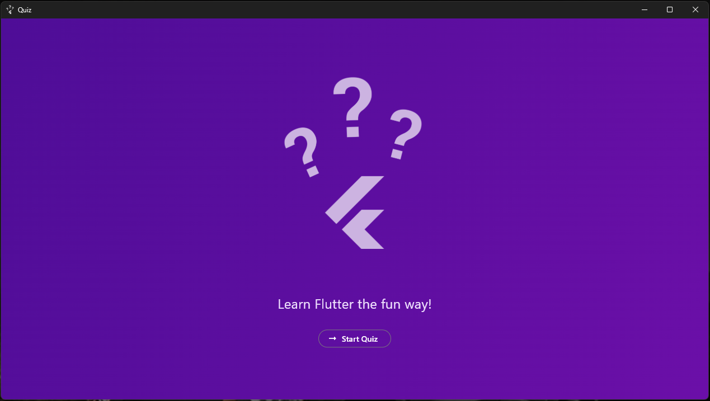
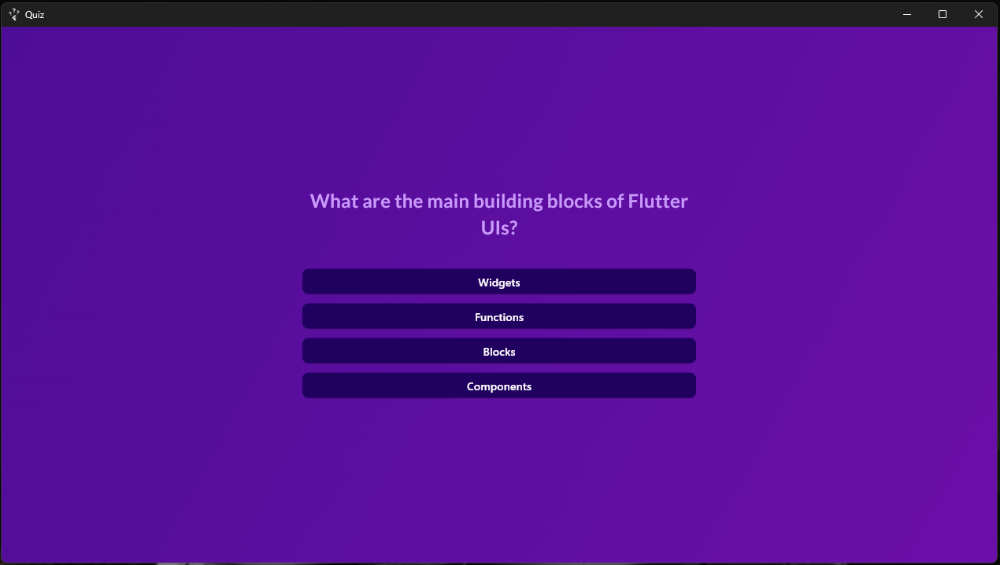
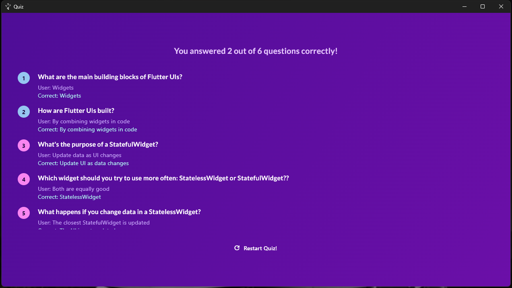
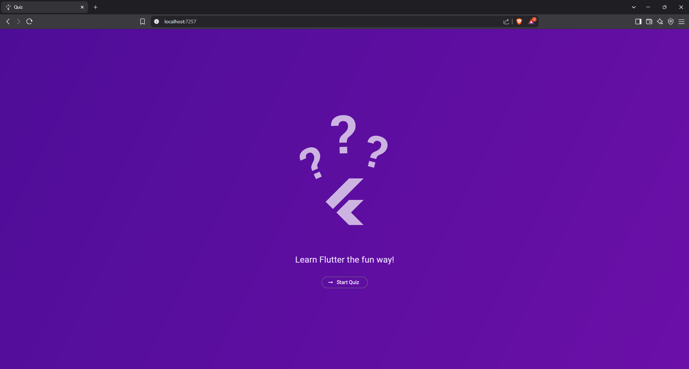
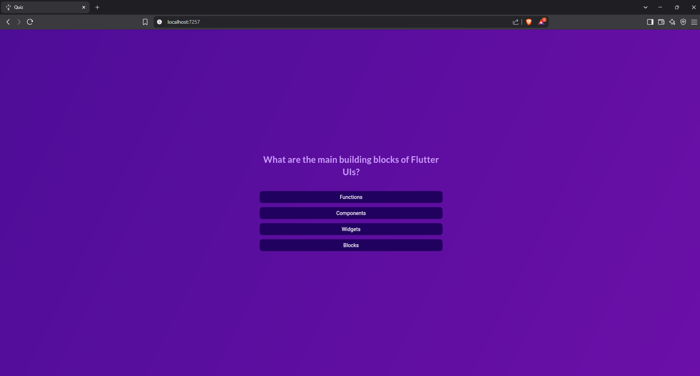
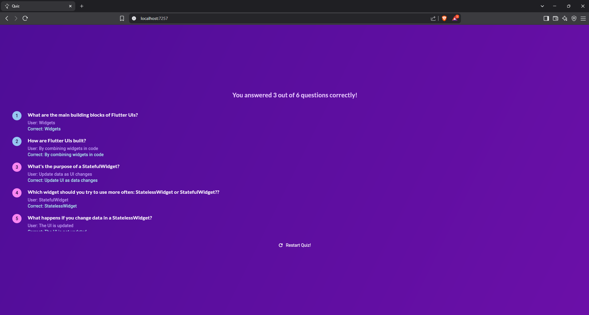
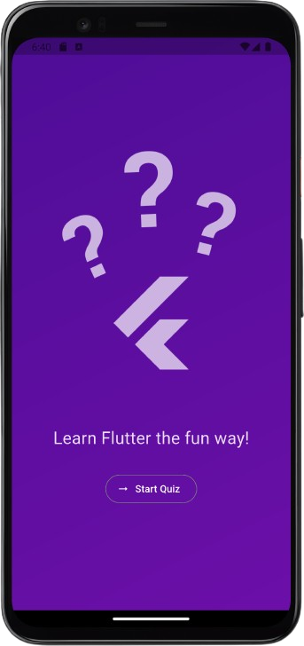
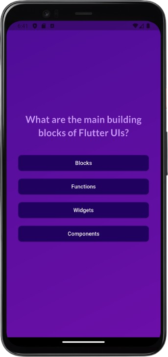
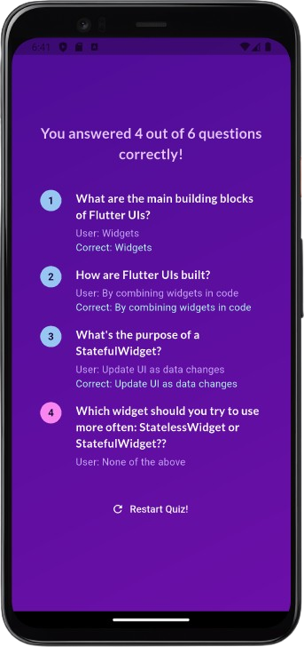

# 📱 Quiz App

A simple yet engaging **Flutter Quiz App** built using Dart and Flutter SDK. This app challenges users with multiple-choice questions, tracks their score, and provides immediate feedback — all in a clean, mobile-friendly UI.

---

## 🚀 Features

- Multiple choice questions
- Score tracking
- Immediate feedback after each answer
- Light and dark theme support
- Responsive UI for phones and tablets
- Timer per question

---

## 🛠️ Tech Stack

- **Flutter** (v3.32.1)
- **Dart**
- **Material 3 Design**

---
## 📦 Platforms Supported

- 🌐️ Web (HTML5)
- 💻 Windows
- 📱 Android

---

## 📸 Screenshots

> Screenshots from each platform

### 🖥️ Windows

| Home                                          | Question                                              | Result                                            |
|-----------------------------------------------|-------------------------------------------------------|---------------------------------------------------|
|  |  |  |

### 🌐 Web

| Home                                  | Question                                      | Result                                    |
|---------------------------------------|-----------------------------------------------|-------------------------------------------|
|  |  |  |

### 📱 Android

| Home                                          | Question                                              | Result                                            |
|-----------------------------------------------|-------------------------------------------------------|---------------------------------------------------|
|  |  |  |


---

## 🌐 Live Demo

- 🔗 **Web (GitHub Pages):**  
  [Demo](https://omnitechphilippines.github.io/quiz-app/)

---

## 📦 Download Releases

- 💻 **Windows (.7z):**  
  [Download for Windows {{VERSION}}](https://github.com/omnitechphilippines/quiz-app/releases/download/{{ENCODED_VERSION}}/windows-release-{{ENCODED_VERSION}}.7z)

- 📱 **Android (.apk):**  
  [Download for Android {{VERSION}}](https://github.com/omnitechphilippines/quiz-app/releases/download/{{ENCODED_VERSION}}/app-release-{{ENCODED_VERSION}}.apk)

- 🌐 **Web build (.7z):**  
  [Download Web Build {{VERSION}}](https://github.com/omnitechphilippines/quiz-app/releases/download/{{ENCODED_VERSION}}/web-release-{{ENCODED_VERSION}}.7z)

> You can also find all versions in the [Releases Page](https://github.com/omnitechphilippines/quiz-app/releases)

---

## 🚀 Getting Started

### Prerequisites

- Flutter SDK `v3.32.1`
- Dart SDK `v3.8.1`

### Run the app

```bash
# Clone the repo
git clone https://github.com/omnitechphilippines/quiz-app.git
cd quiz-app

# Get packages
flutter pub get

# Run the app (Web)
flutter run -d chrome

# Run the app (Windows)
flutter config --enable-windows-desktop
flutter run -d windows

# Run the app (Android)
flutter run -d android